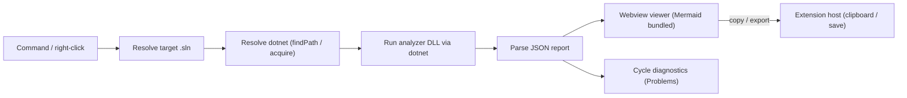

# SharpDeps — .NET Dependency Map

[](https://github.com/Htkym/sharpdeps/actions/workflows/ci.yml)

SharpDeps visualizes the dependencies in a .NET solution as an interactive graph, at both **project** and **namespace** granularity, and flags **circular dependencies**.

The graph opens as a normal editor tab (a webview). Mermaid is bundled into the extension, so rendering works offline with no CDN access.

## Features

- Interactive Mermaid dependency graph for a `.sln`, shown in an editor tab.
- Toggle between **project-level** and **namespace-level** views instantly.
- Circular dependencies are highlighted in red on the graph.
- Cycles are also reported in the **Problems** panel:
  - project cycles anchor to the participating `.csproj` files,
  - namespace cycles anchor to a representative source file for each namespace.
- Export the current graph: **copy Mermaid source**, **save as SVG**, **save as PNG**.
- Run from the Explorer context menu on a `.sln` file, or from the Command Palette.

## Requirements

SharpDeps runs a small precompiled analyzer that needs the **.NET runtime** (not the full SDK).

Resolution order for `dotnet`:

1. The `sharpdeps.dotnetPath` setting, if set.
2. The [.NET Install Tool](https://marketplace.visualstudio.com/items?itemName=ms-dotnettools.vscode-dotnet-runtime) (`dotnet.findPath`). This extension is declared as a dependency and is installed automatically.
3. `dotnet` on your `PATH`.
4. A private runtime acquired on demand via the .NET Install Tool, using VS Code's standard download/progress UI (no administrator rights required).

If none of these succeed, SharpDeps shows a notification with a **Download .NET** link and lets you point at a `dotnet` executable via settings.

## Usage

- Right-click a `.sln` file in the Explorer and choose **SharpDeps: Show Dependency Map**, or
- Run **SharpDeps: Show Dependency Map** from the Command Palette.

While the map is open, these palette commands are available:

- **SharpDeps: Refresh Dependency Map**
- **SharpDeps: Copy Mermaid Source**
- **SharpDeps: Export Graph as SVG**
- **SharpDeps: Export Graph as PNG**

## Settings

| Setting | Default | Description |
| --- | --- | --- |
| `sharpdeps.maxProjects` | `60` | Maximum number of projects in the project-level graph (`--max-projects`). |
| `sharpdeps.maxEdges` | `200` | Maximum number of dependency edges in the graph (`--max-edges`). |
| `sharpdeps.dotnetPath` | `""` | Absolute path to a `dotnet` executable. When empty, SharpDeps resolves one automatically. |

## How it works



The analyzer parses the solution and projects with Roslyn (no MSBuild/SDK dependency) and emits a JSON report. The extension renders it in the webview and publishes any cycles to the Problems panel.

## Building from source

Prerequisites: Node.js, and the .NET SDK (only to precompile the analyzer).

```bash
npm install
npm run build:analyzer   # publishes analyzer/code-map.cs -> analyzer/bin/code-map.dll
npm run build            # bundles the extension host and the webview client
npm run compile          # type-check (tsc --noEmit)
```

Run the extension:

- Open this folder in VS Code and press **F5** (Run Extension) to launch an Extension Development Host.

Package a VSIX:

```bash
npm run package          # runs vscode:prepublish, then vsce package
```

`vscode:prepublish` rebuilds the analyzer DLL and produces a production bundle, so the precompiled analyzer and the bundled viewer are included in the VSIX.

## License

Licensed under the MIT License. See the `LICENSE` file in this folder.
