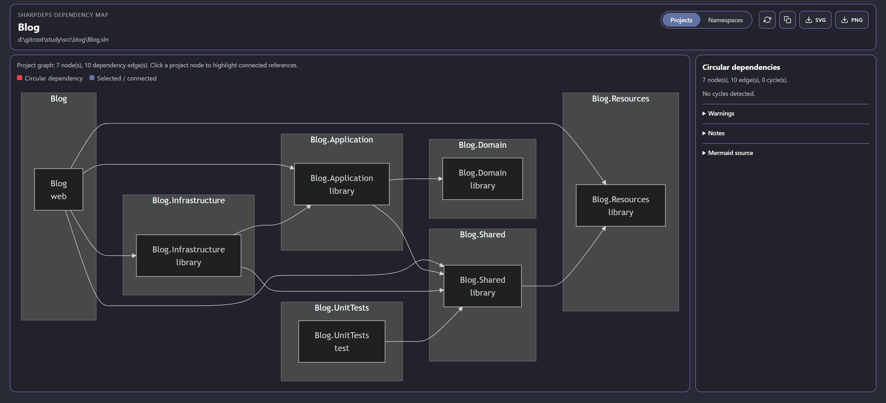
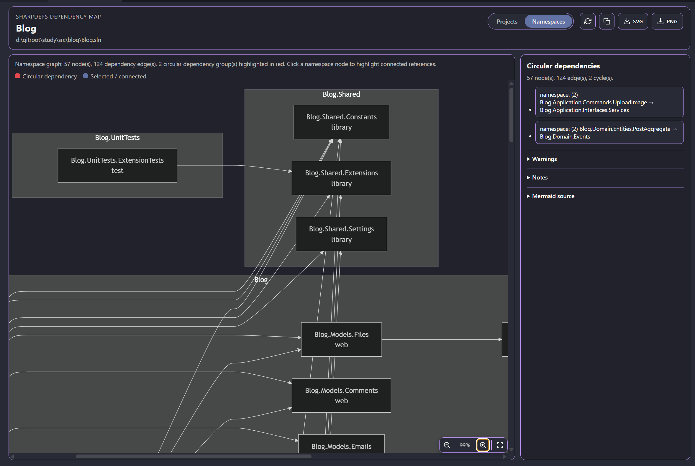
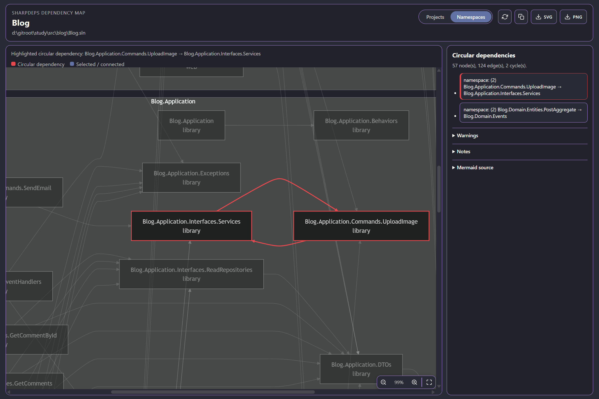
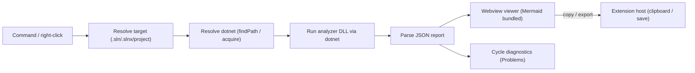

# SharpDeps — .NET Dependency Map

[](https://github.com/Htkym/sharpdeps/actions/workflows/ci.yml)
[](https://marketplace.visualstudio.com/items?itemName=htkym.sharpdeps)

SharpDeps visualizes the dependencies in a .NET solution as an interactive graph, at both **project** and **namespace** granularity, and flags **circular dependencies**.

The graph opens as a normal editor tab (a webview). Mermaid is bundled into the extension, so rendering works offline with no CDN access.



## What's new in 0.1.0

The map is now an interactive SVG view backed by an analysis result, not a rendered Mermaid
diagram. The workflow is **select a dependency → check its evidence → jump to the code**:

- **Graph and table views** of the same selection, with a hierarchy tree and whole-index search on the left.
- **Inspector**: node overview (kind, project, dependencies, dependents, occurrence counts) and, for an edge, the evidence list with `file:line:column`, resolved/inferred and generated marks, paging, and a copy button.
- **Open evidence or a declaration in the editor** from the inspector ("エディターで開く"); generated code opens read-only from the analysis result, and a changed file asks before jumping to a stale line.
- **Editor commands**: `SharpDeps: Show Type Dependencies (cursor)` and `Show Type Dependents (cursor)` reveal the type under the cursor, resolved through declaration positions (never by name).
- **Cycles tab**: the member set and the verified cycle path are shown separately; each path edge opens its evidence.
- **Exports**: Mermaid, JSON, SVG, and PNG of the current selection, plus **Copy for agent** which copies an evidence-backed context (target, conditions, evidence, cycles, limits, and an explicit "do not assert" list). Nothing is sent anywhere.
- **State restore**: the panel comes back with the target, selection, filters, and camera after hiding the tab or reloading the window, without starting an analysis.
- **Keyboard**: `/` search, `g`/`t` graph/table, `Enter` select, `Esc` close the inspector, `+`/`-`/`0` zoom.
- Measurements for the analyzer live in [docs/performance.md](docs/performance.md); the semantic model is described in [docs/analysis-semantics.md](docs/analysis-semantics.md).

The screenshots below show the earlier UI; the commands and settings are unchanged unless
noted here.

## Features

- Interactive Mermaid dependency graph for a `.sln`, `.slnx`, or supported project file (`.csproj`/`.fsproj`/`.vbproj`/`.vcxproj`), shown in an editor tab.
- Toggle between **project-level** and **namespace-level** views instantly.
- Nodes are **color-coded by project kind** (web, library, test, desktop, app), with a legend that lists the kinds present in the current graph.
- Zoom and pan the graph: on-screen controls (including a **zoom slider**), Ctrl/⌘ + wheel, trackpad pinch, and drag to pan. The graph fits the available window when it opens and re-fits on resize.
- Tune the layout with **node-spacing** and **rank-spacing** sliders, and resize the graph and cycle panes with a draggable splitter.
- **Hide test projects** with a single toggle: the graph re-lays out without them so the remaining dependencies are easier to read.
- Circular dependencies are highlighted in red on the graph.
- Cycles are also reported in the **Problems** panel:
  - project cycles anchor to the participating `.csproj` files,
  - namespace cycles anchor to a representative source file for each namespace.
- Export the current graph: **copy Mermaid source**, **save as SVG**, **save as PNG**.
- Copy a compact analysis summary and handoff instructions for an AI coding agent from the toolbar.
- Run from the Explorer context menu on a `.sln`, `.slnx`, or supported project file, or from the Command Palette. Right-clicking a project file generates a project-scoped graph for that project and everything it transitively references via `ProjectReference`, with no `.sln`/`.slnx` required.

## Screenshots

Namespace-level view — switch granularity with the **Projects / Namespaces** toggle to group dependencies by namespace:



Circular dependencies are highlighted in red on the graph and listed in the sidebar; selecting one focuses the participating nodes:



## Install

- **From the Marketplace:** open the Extensions view in VS Code, search for **SharpDeps**, and install — or visit the [Marketplace page](https://marketplace.visualstudio.com/items?itemName=htkym.sharpdeps).
- **From a VSIX:** download the latest `.vsix` from the [Releases](https://github.com/Htkym/sharpdeps/releases) page, then run **Extensions: Install from VSIX…** from the Command Palette.

The [.NET Install Tool](https://marketplace.visualstudio.com/items?itemName=ms-dotnettools.vscode-dotnet-runtime) is installed automatically as a dependency. See [Requirements](#requirements) for how the `dotnet` runtime is resolved.

## Requirements

SharpDeps runs a small precompiled analyzer that needs the **.NET runtime** (not the full SDK).

Resolution order for `dotnet`:

1. The `sharpdeps.dotnetPath` setting, if set.
2. The [.NET Install Tool](https://marketplace.visualstudio.com/items?itemName=ms-dotnettools.vscode-dotnet-runtime) (`dotnet.findPath`). This extension is declared as a dependency and is installed automatically.
3. `dotnet` on your `PATH`.
4. A private runtime acquired on demand via the .NET Install Tool, using VS Code's standard download/progress UI (no administrator rights required).

If none of these succeed, SharpDeps shows a notification with a **Download .NET** link and lets you point at a `dotnet` executable via settings.

## Usage

- Right-click a `.sln`, `.slnx`, or supported project file (`.csproj`/`.fsproj`/`.vbproj`/`.vcxproj`) in the Explorer and choose **SharpDeps: Show Dependency Map**. Right-clicking a project file generates a project-scoped graph for that project and everything it transitively references via `ProjectReference`, with no `.sln`/`.slnx` required.
- Run **SharpDeps: Show Dependency Map** from the Command Palette. If the active editor is a `.sln`, `.slnx`, or supported project file, SharpDeps uses that; otherwise it falls back to discovering `.sln`/`.slnx` files in the workspace.

While the map is open, these palette commands are available:

- **SharpDeps: Refresh Dependency Map**
- **SharpDeps: Copy Mermaid Source**
- **SharpDeps: Export Graph as SVG**
- **SharpDeps: Export Graph as PNG**

## Settings

| Setting | Default | Description |
| --- | --- | --- |
| `sharpdeps.maxProjects` | `60` | Maximum number of projects in the project-level graph (`--max-projects`). |
| `sharpdeps.maxEdges` | `200` | Maximum number of dependency edges in the graph (`--max-edges`). |
| `sharpdeps.dotnetPath` | `""` | Absolute path to a `dotnet` executable. When empty, SharpDeps resolves one automatically. |

## How it works


```mermaid
flowchart LR
  cmd["Command / right-click"] --> resolve["Resolve target (.sln/.slnx/project)"]
  resolve --> rt["Resolve dotnet (findPath / acquire)"]
  rt --> run["Run analyzer DLL via dotnet"]
  run --> json["Parse JSON report"]
  json --> view["Webview viewer (Mermaid bundled)"]
  json --> diag["Cycle diagnostics (Problems)"]
  view -->|copy / export| ext["Extension host (clipboard / save)"]
```

The analyzer parses the selected solution or project scope with Roslyn (no MSBuild/SDK dependency) and emits a JSON report. The extension renders it in the webview and publishes any cycles to the Problems panel.

## Building from source

Prerequisites: Node.js, and the .NET SDK (only to precompile the analyzer).

```bash
npm install
npm run build:analyzer   # publishes the analyzer solution -> analyzer/bin/quick, analyzer/bin/semantic
npm run build            # bundles the extension host and the webview client
npm run compile          # type-check (tsc --noEmit)
```

The analyzers build from `analyzer/SharpDeps.Analyzer.slnx`:

```bash
dotnet build analyzer/SharpDeps.Analyzer.slnx -c Release
dotnet test analyzer/SharpDeps.Analyzer.slnx -c Release
```

Run the extension:

- Open this folder in VS Code and press **F5** (Run Extension) to launch an Extension Development Host.

Package a VSIX:

```bash
npm run package          # runs vscode:prepublish, then vsce package
```

`vscode:prepublish` rebuilds the analyzer DLL and produces a production bundle, so the precompiled analyzer and the bundled viewer are included in the VSIX.

## License

Licensed under the MIT License. See the `LICENSE` file in this folder.
