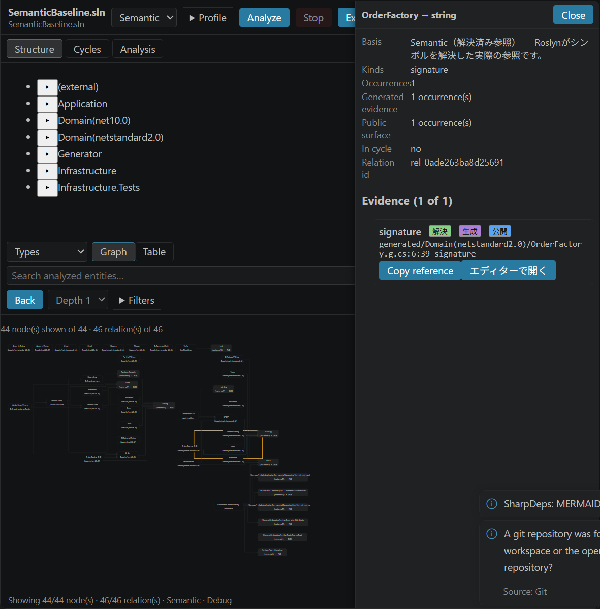

# SharpDeps — .NET Dependency Map

[](https://github.com/Htkym/sharpdeps/actions/workflows/ci.yml)
[](https://marketplace.visualstudio.com/items?itemName=htkym.sharpdeps)

SharpDeps visualizes the dependencies in a .NET solution as an interactive graph, at **project**, **namespace**, and **type** granularity, and flags **circular dependencies**.

The graph opens as a normal editor tab. SVG rendering and ELK layout run locally in the webview, without a CDN.



## What's new in 0.1.0

The map is now an interactive SVG view backed by an analysis result, not a rendered Mermaid
diagram. The workflow is **select a dependency → check its evidence → jump to the code**:

- **Graph and table views** of the same selection, with a hierarchy tree and whole-index search on the left.
- **Inspector**: node overview (kind, project, dependencies, dependents, occurrence counts) and, for an edge, the evidence list with `file:line:column`, resolved/inferred and generated marks, paging, and a copy button.
- **Open evidence or a declaration in the editor** from the inspector ("エディターで開く"); generated code opens read-only from the analysis result, and a changed file asks before jumping to a stale line.
- **Editor commands**: `SharpDeps: Show Type Dependencies (cursor)` and `Show Type Dependents (cursor)` reveal the type under the cursor, resolved through declaration positions (never by name).
- **Cycles tab**: the member set and the verified cycle path are shown separately; each path edge opens its evidence.
- **Exports**: Mermaid, JSON, SVG, and PNG of the current selection, plus **Copy for agent** which copies an evidence-backed context (target, conditions, evidence, cycles, limits, and an explicit "do not assert" list). Nothing is sent anywhere.
- **State restore**: the panel comes back with the target, selection, filters, and camera after hiding the tab or reloading the window, without starting an analysis.
- **Keyboard**: `/` search, `g`/`t` graph/table, `Enter` select, `Esc` close the inspector, `+`/`-`/`0` zoom.
- **Graph controls**: zoom buttons and slider, Fit, node/rank spacing, layout cancellation and retry, and a project-kind legend. SVG/PNG can include the actual profile, TFMs, scope, omissions, and legend.
- Measurements for the analyzer live in [docs/performance.md](docs/performance.md); the semantic model is described in [docs/analysis-semantics.md](docs/analysis-semantics.md).

## Analysis modes

- **Quick** reads declared project references and infers namespace dependencies from `using` directives. It needs a .NET 10 runtime; it does not evaluate MSBuild projects or require the SDK.
- **Semantic** evaluates C# projects with MSBuild and resolves references with Roslyn. Select Semantic and choose Analyze to use it. It requires an installed .NET SDK compatible with the target and its `global.json`; SharpDeps does not acquire an SDK or restore packages automatically.
- Both modes keep declared, inferred, and resolved relations distinct. Display limits affect the graph, not discovery, search, or cycle detection.
- Analysis requires a trusted workspace. A failed or cancelled run preserves the previous successful result and its evidence.

Use **Profile** for Configuration and Platform. After a Semantic analysis, the **Analysis** tab offers per-project target framework choices. Automatic keeps evaluated variants separate; a manual choice that conflicts with an evaluated project reference reports an error.

Use **Filters** for project/type kinds, relation basis, relation kinds, tests, external types, and generated types. Select an entity to explore dependencies or dependents at depth 1–3. Double-click a project or namespace to drill down, and use Back to restore the preceding scope.

## Install

- **From the Marketplace:** open the Extensions view in VS Code, search for **SharpDeps**, and install — or visit the [Marketplace page](https://marketplace.visualstudio.com/items?itemName=htkym.sharpdeps).
- **From a VSIX:** download the latest `.vsix` from the [Releases](https://github.com/Htkym/sharpdeps/releases) page, then run **Extensions: Install from VSIX…** from the Command Palette.

The [.NET Install Tool](https://marketplace.visualstudio.com/items?itemName=ms-dotnettools.vscode-dotnet-runtime) is installed automatically as a dependency. See [Requirements](#requirements) for how the `dotnet` runtime is resolved.

## Requirements

Quick requires the **.NET 10 runtime**. Semantic additionally requires an installed **.NET SDK** and restored project dependencies.

Quick resolves `dotnet` in this order:

1. The `sharpdeps.dotnetPath` setting, if set.
2. The [.NET Install Tool](https://marketplace.visualstudio.com/items?itemName=ms-dotnettools.vscode-dotnet-runtime) (`dotnet.findPath`). This extension is declared as a dependency and is installed automatically.
3. `dotnet` on your `PATH`.
4. A private runtime acquired on demand via the .NET Install Tool, using VS Code's standard download/progress UI (no administrator rights required).

If none of these succeed, SharpDeps shows a notification with a **Download .NET** link and lets you point at a `dotnet` executable via settings.

Semantic uses `sharpdeps.dotnetPath` or `dotnet` on `PATH` and checks SDK resolution in the target directory. It does not fall back to runtime acquisition.

## Usage

- Right-click a `.sln`, `.slnx`, or supported project file (`.csproj`/`.fsproj`/`.vbproj`/`.vcxproj`) in the Explorer and choose **SharpDeps: Show Dependency Map**. Right-clicking a project file generates a project-scoped graph for that project and everything it transitively references via `ProjectReference`, with no `.sln`/`.slnx` required.
- Run **SharpDeps: Show Dependency Map** from the Command Palette. If the active editor is a `.sln`, `.slnx`, or supported project file, SharpDeps uses that; otherwise it falls back to discovering `.sln`/`.slnx` files in the workspace.

While the map is open, these palette commands are available:

- **SharpDeps: Refresh Dependency Map**
- **SharpDeps: Copy Mermaid Source**
- **SharpDeps: Export Graph as SVG**
- **SharpDeps: Export Graph as PNG**

## Settings

| Setting | Default | Description |
| --- | --- | --- |
| `sharpdeps.maxProjects` | `60` | Project display limit; analysis still covers the full scope. |
| `sharpdeps.maxVisibleTypes` | `100` | Type display limit. Search can add entities outside the limit. |
| `sharpdeps.analysisMode` | `quick` | Initial analysis mode. |
| `sharpdeps.analysisTimeoutSeconds` | `180` | Time limit for an analysis. |
| `sharpdeps.maxEdges` | `200` | Maximum number of dependency edges in the graph (`--max-edges`). |
| `sharpdeps.dotnetPath` | `""` | Absolute path to a `dotnet` executable. When empty, SharpDeps resolves one automatically. |

## How it works


```mermaid
flowchart LR
  cmd["Command / right-click"] --> resolve["Resolve target (.sln/.slnx/project)"]
  resolve --> rt["Resolve dotnet (findPath / acquire)"]
  rt --> run["Run analyzer DLL via dotnet"]
  run --> json["Parse JSON report"]
  json --> view["SVG workbench / ELK worker"]
  json --> diag["Cycle diagnostics (Problems)"]
  view -->|copy / export| ext["Extension host (clipboard / save)"]
```

The selected analyzer writes a validated JSON report and indexed evidence. The extension derives graph and table projections from that result, serves evidence on demand, and publishes cycles to the Problems panel.

## Building from source

Prerequisites: Node.js 20 or later and .NET SDK 10.

```bash
npm install
npm run build:analyzer   # publishes the analyzer solution -> analyzer/bin/quick, analyzer/bin/semantic
npm run build            # bundles the extension host and the webview client
npm run compile          # type-check (tsc --noEmit)
```

The analyzers build from `analyzer/SharpDeps.Analyzer.slnx`:

```bash
dotnet build analyzer/SharpDeps.Analyzer.slnx -c Release
dotnet test analyzer/SharpDeps.Analyzer.slnx -c Release
```

Run the extension:

- Open this folder in VS Code and press **F5** (Run Extension) to launch an Extension Development Host.

Package a VSIX:

```bash
npm run package          # runs vscode:prepublish, then vsce package
```

`vscode:prepublish` rebuilds the analyzer DLL and produces a production bundle, so the precompiled analyzer and the bundled viewer are included in the VSIX.

## License

Licensed under the MIT License. See the `LICENSE` file in this folder.
