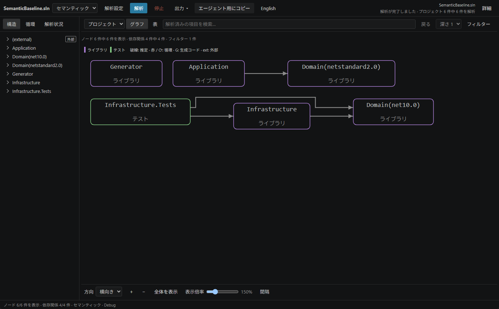
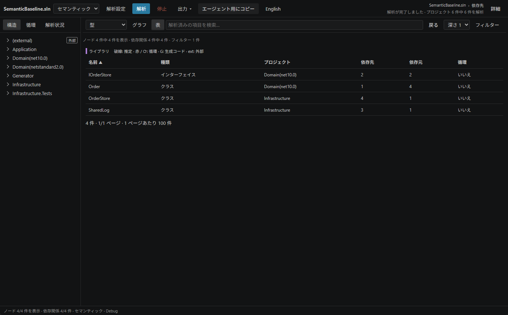
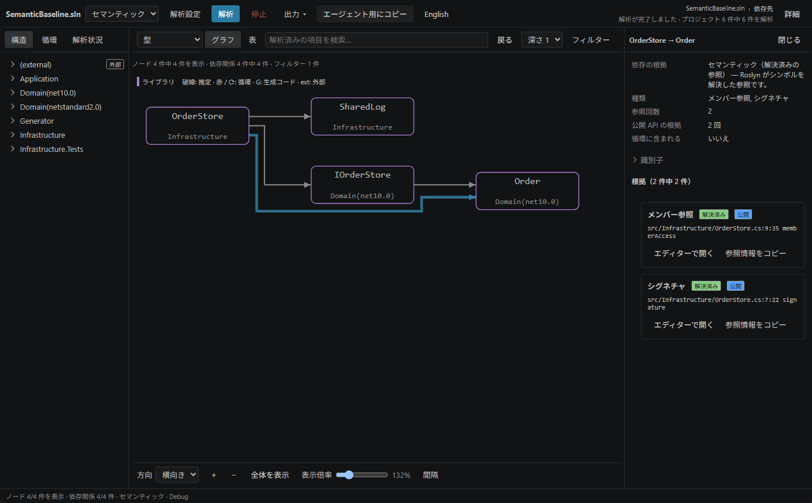
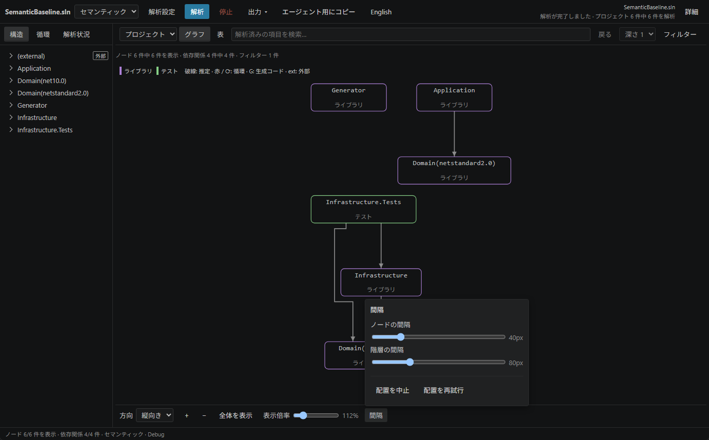

# SharpDeps 操作ガイド

[English](guide.md) · 日本語 · [README](../README.ja.md)

このガイドでは **0.1.0 の画面** について説明します。画像は、VS Code で `tests/fixtures/semantic-baseline/SemanticBaseline.sln` を実際に解析したときの画面です。例をわかりやすくするため、グラフと表では外部の型を非表示にしています。

## ソリューションやプロジェクトを開く

1. 対象フォルダーを VS Code で開きます。解析を実行する際は、ワークスペースを信頼済みに設定してください。
2. エクスプローラーで `.sln`、`.slnx`、またはプロジェクトファイルを右クリックし、**SharpDeps: Show Dependency Map** を選びます。クイックモードは `.csproj`、`.fsproj`、`.vbproj`、`.vcxproj` に対応しています。セマンティックモードは SDK スタイルの C# プロジェクトを想定しています。
3. 解析が終わるまでお待ちください。画面上部に対象と解析の進行状況が表示され、ノードや依存関係の件数は現在画面に表示されている内容を反映します。

コマンドパレットから同じコマンドを実行した場合は、アクティブなエディターで開いている対応ファイルを使うか、ワークスペース内のソリューションを自動で検索します。候補が複数ある場合は対象を選択してください。プロジェクトファイルを選んだ場合は、そのプロジェクトの参照先をたどって解析します。

この例では、`Infrastructure` が `Domain(net10.0)` に依存しています。`Domain(netstandard2.0)` は別のターゲットフレームワークでの結果です。プロジェクト名が同じであっても、二つの結果が一つにまとめられることはありません。

## 解析モードを選ぶ

プロジェクトや名前空間の全体像をまず確認したいときは、**クイック** を使います。プロジェクトの XML と `using` を直接読み込み、MSBuild による評価は行いません。そのため、条件付きの参照や未使用の `using` が結果に含まれることがあります。動作には .NET 10 ランタイムが必要です。実行する `dotnet` は、`sharpdeps.dotnetPath`、.NET Install Tool、`PATH`、専用ランタイムの取得の順に検索・解決されます。

C# の型やコードレベルでの参照を調べる場合は、**セマンティック** を使います。

1. 対象および `global.json` に対応する SDK をインストールし、.NET 10 ランタイムを使える状態にしておきます。
2. 対象のパッケージを手動で復元します。たとえば、ターミナルで `dotnet restore path/to/YourSolution.sln` を実行してください。
3. 画面上部で **セマンティック** を選びます。必要に応じて、**解析設定** で構成やプラットフォームを指定してください。
4. **解析** を押します。読み込み完了後は、**解析状況** タブでプロジェクトごとのターゲットフレームワークを選択できるようになります。**自動** では、評価済みの参照先ごとに結果を分けて表示します。フレームワークや解析設定を変更した場合は再解析してください。組み合わせに矛盾がある場合はエラーが表示されます。

SharpDeps が SDK をダウンロードしたり、パッケージを自動で復元したりすることはありません。セマンティックモードではプロジェクトのビルド処理やソースジェネレーターを評価するため、ワークスペースの信頼が必須です。クイックモードには推定された依存関係が含まれます。セマンティックモードでも、プロジェクトや参照の読み込みに失敗すると一部の結果しか得られないことがあります。結果を判断する前に、解析状況タブで解析範囲と制限事項を確認してください。

## 依存関係を探して絞り込む

グラフの上で **プロジェクト**、**名前空間**、**型** を選んで表示単位を切り替えます。型レベルの表示にはセマンティック解析が必要です。左側の三角アイコンを押すと階層を展開できます。検索機能は、表示上限から外れている項目も含め、解析済みの全要素を対象に検索します。

ノードを選ぶと **詳細** が開きます。**依存先** ではその項目が参照している依存先を、**依存元** ではその項目を参照している依存元を確認できます。**深さ 1–3** で参照を何段階たどるかを指定できます。プロジェクトや名前空間をダブルクリックすると、その内部だけに絞り込めます。**戻る** を押すと前の範囲に戻ります。検索キーワードでグラフが絞り込まれたままになっている場合は、検索欄をクリアすると選択範囲内の他の項目も再表示できます。

**フィルター** では、プロジェクトや型の種類、依存関係の種類と根拠、テスト、外部の型、生成コードなどの表示条件を選択できます。チェックが一つもないカテゴリは、すべての項目が表示対象となります。Escape キーを押すか、パネルの外側をクリックすると閉じられます。フィルターを変更しても再解析は行われません。

**表** に切り替えると、同じ範囲の一覧を並べ替えて確認できます。行を選んで詳細を調べ、接続関係を視覚的に見たいときは **グラフ** に戻してください。

## 線と参照の根拠を読む

矢印は、参照元から参照先へ向かって伸びます。ノードの色はプロジェクトの種類を表しており、グラフ上部の凡例で確認できます。

| 表示 | 意味 |
| --- | --- |
| 実線 | 表示中の依存関係に、宣言、評価、シンボル解決のいずれかに基づくものが含まれています。クイックモードのプロジェクト参照は宣言を示しているだけであり、コンパイル時に実際に使われていることを証明するものではありません。 |
| 破線 | 推定された依存関係のみが存在することを示します。たとえば、`using` から推定した名前空間の依存関係などが該当します。 |
| 赤い線や循環の印 | その接続や項目が、検出された循環グループに含まれていることを示します。 |
| `G` / `ext` | 自動生成コードまたは外部の型であることを示します。依存の根拠とは別の情報です。 |

ノード間の同じ方向の接続は一本にまとめられます。複数の依存関係が集約された場合でも、詳細パネルで個々の根拠や参照回数を確認できます。内訳の依存関係を選ぶと、その根拠を選択したまま、対応する接続線が強調表示されます。

ソースコード内の参照箇所を確認する手順は次のとおりです。

1. グラフ上の線を選択します。**詳細** に、依存の根拠、種類、件数、コード上の参照位置が表示されます。
2. 複数の依存関係をまとめた線では、調べたい内訳の **根拠** を押します。最初に表示される根拠一覧には、代表となる依存関係の参照が表示されています。
3. 参照の横にある **エディターで開く** を押します。生成コードは解析結果をもとに読み取り専用で開きます。解析後にファイルが変更されている場合は、古い位置に移動する前に確認が表示されます。

この例では、`OrderStore → Order` を選択しています。根拠欄には、`OrderStore.cs` 内で `Order` を参照している具体的なコード位置と参照の種類が表示されます。**参照情報をコピー** でその位置をコピーでき、型の **宣言を開く** を押すとその型の宣言箇所へ移動できます。なお、依存先や依存元の件数は重複を除いた項目数を表し、参照回数は根拠の総数を表すため、同じ数字になるとは限りません。

C# のエディター上で **SharpDeps: Show Type Dependencies (cursor)** や **Show Type Dependents (cursor)** を使うと、カーソル位置の型を宣言元から特定し、その依存先や依存元を表示できます。これらのコマンドを利用するにはセマンティック解析が必要です。

## グラフの配置を調整する

レイアウトの操作は **下部のバー** にまとまっています。

| 操作 | 内容 |
| --- | --- |
| **方向** | **横向き** と **縦向き** でグラフの向きを切り替えます。縦向きで横幅が収まる場合は、左右の中央に自動で配置されます。 |
| `+`、`−`、表示倍率 | 表示倍率を変更します。グラフ上で Ctrl（または Command）キーを押しながらマウスホイールを回して拡大縮小することもできます。 |
| **全体を表示** | グラフ全体を表示領域に収めます。規模の大きなグラフでは文字が小さくなるため、適宜拡大してスクロールすると読みやすくなります。 |
| **間隔** | ボタンの上に設定パネルが開き、**ノードの間隔** や **階層の間隔** を調整できます。 |
| **配置を中止** / **配置を再試行** | 解析処理を止めずに、グラフのレイアウト計算のみを中断したり再試行したりできます。配置に失敗した場合や中断した場合でも、表ビューで結果を確認できます。 |

グラフの何もない場所をドラッグするか、スクロールバーを使って表示位置を移動します。ナビゲーションや詳細パネルの幅は、境界線をドラッグして変更できます。狭いペインでも下部バーを横にスクロールできるため、隠れている操作にアクセスできます。向き、倍率、間隔を変更しても再解析は発生しません。

## 循環を確認する

左側の **循環** を開き、**この循環を表示** を押すと、その循環グループに絞り込めます。一覧のメンバーは要素の集合を示しているだけであり、並び順がそのまま循環経路を表しているわけではありません。**確認済みの閉路あり** と表示されている場合は、列挙された接続線がアナライザーによって検証された経路を構成しています。経路上の接続線を選ぶと、その根拠を確認できます。

クイックモードでは、宣言や推定に基づいて依存の循環を検出することがあります。これは実行されたコードの証拠としてではなく、参照を確認するきっかけとして活用してください。閉路が未確認の場合はその旨が表示されますので、メンバー一覧だけを見て確認済みの経路があると判断しないようにしてください。循環に関する診断情報は、VS Code の「問題」パネルにも表示されます。

## 表示中の範囲を出力する

**出力** から Mermaid、JSON、SVG、PNG を選択して出力できます。テキストと JSON は現在表示されている項目と接続を対象とし、SVG や PNG には表示中の向きがそのまま反映されます。同じメニューの画像設定では、対象と解析設定、表示範囲と省略情報、凡例を含めるかどうかを選択できます。出力ファイルは VS Code のダイアログから保存してください。

**エージェント用にコピー** を押すと、根拠を含む説明テキストがクリップボードへコピーされます。これには対象、条件、参照の根拠、循環依存、省略情報、判断できる範囲が含まれます。外部サービスへのデータ送信は行いません。なお、名前やコード断片にソースコードの情報が含まれることがあるため、共有する前にコピーした内容を確認してください。

## 表示言語と状態の保存

上部の **日本語** または **English** で表示言語を切り替えます。選択した言語は保存され、切り替えても再解析は行われません。コードのシンボル名やファイルパス、解析プログラムの診断メッセージは元の文字列のまま表示されます。

対象、表示範囲、選択状態、フィルター、レイアウト、ペイン幅、表示位置、倍率はすべて保存されます。非表示にしたタブに戻ったときやウィンドウを再読み込みした際も、再解析を行わずに直前の画面状態を復元します。編集や設定変更によって結果が古くなった場合は、**解析** で最新の状態に更新してください。**停止** は解析を停止する操作で、直前に成功した結果はそのまま残ります。

## キーボードで操作する

入力欄でテキストを入力している間は、検索や表示切り替えのショートカットキーは無効になります。倍率変更のショートカットは、グラフにフォーカスがあるときに使用できます。Escape キーは、入力中であっても開いているパネルや詳細ビューを閉じる操作に使えます。

| キー | 操作 |
| --- | --- |
| `/` | 検索へ移動します。 |
| `g` / `t` | グラフ表示と表表示を切り替えます。 |
| Tab / Shift+Tab | フォーカスを前後の項目へ移動します。 |
| Enter | フォーカスのあるノード、接続、行を選択・操作します。 |
| Space | フォーカスのあるグラフのノードや接続を選択・操作します。 |
| Escape | パネルや詳細を閉じます。パネルや詳細が開いていない場合は選択を解除します。 |
| `+` / `−` / `0` | グラフを拡大 / 縮小 / 全体表示します。 |
| ペインの境界で矢印キー | ペインの幅を変更します。 |

## 設定と困ったときの確認

| 設定 | 既定値 | 用途 |
| --- | --- | --- |
| `sharpdeps.analysisMode` | `quick` | 最初の解析モード。 |
| `sharpdeps.analysisTimeoutSeconds` | `180` | 解析の制限時間（秒）。 |
| `sharpdeps.maxProjects` | `60` | プロジェクトと名前空間の表示上限。 |
| `sharpdeps.maxVisibleTypes` | `100` | 型の表示上限。 |
| `sharpdeps.maxEdges` | `200` | 接続の表示上限。 |
| `sharpdeps.dotnetPath` | `""` | `dotnet` の絶対パスを指定できます。セマンティックモードは、この設定または `PATH` を使い、対象ディレクトリでの SDK 解決を確認します。 |

| 状況 | 確認すること |
| --- | --- |
| 解析を開始できない | ワークスペースを信頼してください。クイックモードではランタイム、セマンティックモードでは SDK、`global.json`、パッケージの復元状態を確認します。 |
| 型を表示できない | セマンティックモードを選び、解析を実行してください。 |
| 項目が画面に見つからない | 表示範囲、検索キーワード、フィルター、表示上限の設定を確認します。検索は解析済みの項目全体を対象にしており、解析できなかった項目は制限事項で確認できます。 |
| 配置に失敗した、または中止した | 表ビューで結果を確認できます。間隔の設定にある「配置を再試行」でレイアウトをやり直してください。 |
| 結果が古くなった | 保存する編集内容を確認して保存し、再度解析を実行してください。 |
| 解析に失敗した、または停止した | 解析状況の制限事項と、VS Code の出力パネルにある **SharpDeps** を確認してください。直前の成功した結果はそのまま残ります。 |
