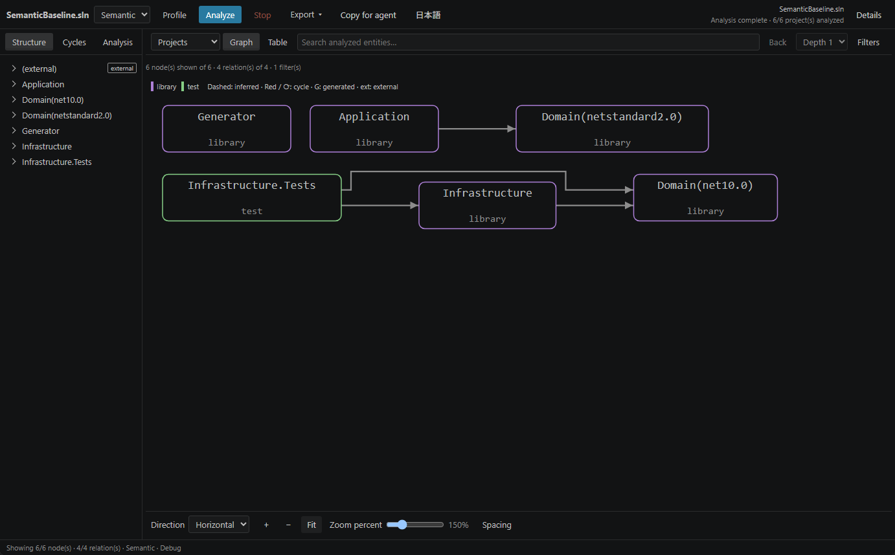
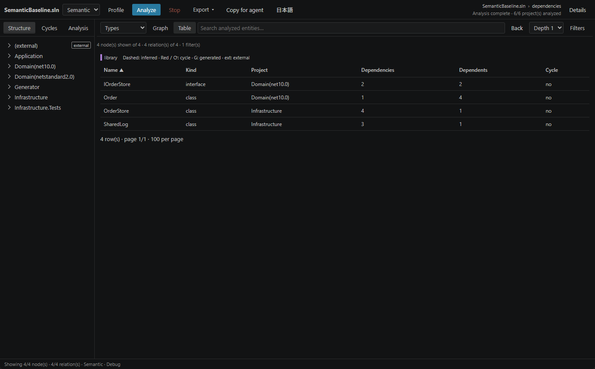
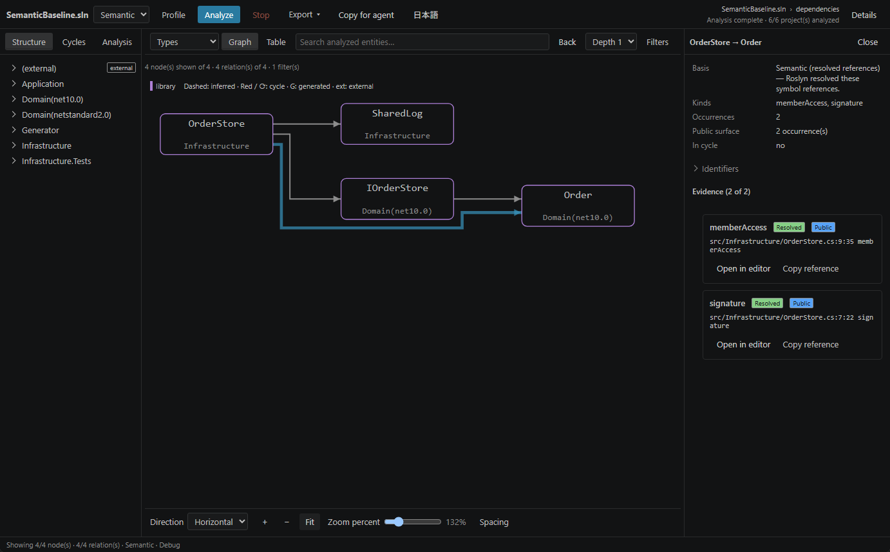
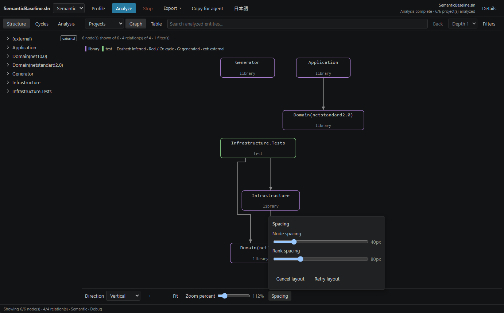

# SharpDeps user guide

English · [日本語](guide.ja.md) · [README](../README.md)

This guide covers the **0.1.0 workbench**. The screenshots show a real analysis of `tests/fixtures/semantic-baseline/SemanticBaseline.sln` in VS Code. External types are hidden in the graph and table to keep the example focused.

## Open a solution or project

1. Open the target folder in VS Code and trust the workspace if you intend to run analysis.
2. In Explorer, right-click a `.sln`, `.slnx`, or project file and choose **SharpDeps: Show Dependency Map**. Quick accepts `.csproj`, `.fsproj`, `.vbproj`, and `.vcxproj`; Semantic is intended for SDK-style C# projects.
3. Wait for analysis to finish. The target and status appear at the top; the node and connection counts describe the current display.

From the Command Palette, the same command uses a supported file in the active editor, or discovers solutions in the workspace. If several candidates are found, select the target you want. A project-file target includes its transitive project references.

In this example, `Infrastructure` depends on `Domain(net10.0)`. `Domain(netstandard2.0)` is a separate target-framework variant; matching names do not mean the two results are merged.

## Choose an analysis mode

Use **Quick** for a first project/namespace overview. It reads project XML and `using` directives without evaluating MSBuild, so conditional references and unused imports may appear. It needs a .NET 10 runtime. Runtime resolution tries `sharpdeps.dotnetPath`, the .NET Install Tool, `PATH`, then private runtime acquisition.

Use **Semantic** to investigate C# types and code references:

1. Install an SDK compatible with the target and its `global.json`, and make a .NET 10 runtime available.
2. Restore the target's packages yourself, for example with `dotnet restore path/to/YourSolution.sln` in a terminal.
3. Select **Semantic** at the top. If needed, use **Profile** to set Configuration and Platform.
4. Choose **Analyze**. After loading, the **Analysis** tab offers per-project target-framework choices. **Automatic** keeps evaluated variants separate. Changing a framework or profile requires another analysis; conflicting framework choices are reported as errors.

SharpDeps does not download an SDK or restore packages automatically. It requires workspace trust because Semantic evaluates project build logic and source generators. Quick provides inferred relationships; Semantic may still report incomplete results when projects or references cannot be loaded. Read the Analysis tab's coverage and limitations before drawing conclusions.

## Find and narrow dependencies

Choose **Projects**, **Namespaces**, or **Types** above the graph. Types require Semantic analysis. Expand the left-hand hierarchy with its chevrons, or use search to find an entity across the full analyzed index, including entities outside the display limit.

Select a node to open **Details**. Choose **Dependencies** to follow its outgoing references, or **Dependents** to find what refers to it. **Depth 1–3** controls how many steps to follow. Double-click a project or namespace to drill down; **Back** returns to the preceding scope. If a search term still restricts the graph, clear it to see the other entities in the chosen scope.

Open **Filters** to include project kinds, type kinds, relation kinds and basis, tests, external types, and generated types. A category with no checked choices includes all its values. Close the panel with Escape or an outside click. Filtering changes the view without rerunning analysis.

Switch to **Table** for a sortable list of the same scope. Select a row to inspect that entity, then return to **Graph** to see its connections.

## Read connections and evidence

An arrow points from the dependent entity to the entity it depends on. Node colors identify project kinds, with a legend above the graph.

| Appearance | Meaning |
| --- | --- |
| Solid line | At least one included relation is declared, evaluated, or symbol-resolved. In Quick, a declared project reference does not prove that the compiled code uses it. |
| Dashed line | Only inferred relationships exist, such as a namespace dependency suggested by `using`. |
| Red line or cycle mark | The connection or entity belongs to a detected cycle group. |
| `G` / `ext` | Generated code / an external type. These marks are separate from the relation's basis. |

A directed node pair has one visible connection. When several relations contribute to it, Details retains their separate basis and occurrence counts. Selecting an underlying relation keeps its own evidence selected and highlights the shared connection.

To inspect a source reference:

1. Select a connection in the graph. **Details** shows the basis, relation kinds, counts, and source evidence.
2. If the connection aggregates several relations, choose **Evidence** for the underlying relation you want. The initial evidence list belongs to the representative relation.
3. Choose **Open in editor** beside a reference. Generated documents open read-only from the analysis result. For a file changed since analysis, SharpDeps asks before jumping to an outdated location.

The example selects `OrderStore → Order`. The evidence shows where `Order` appears in `OrderStore.cs`, including its reference kind and source position. **Copy reference** copies a location; **Open declaration** on a type opens its declaration. Dependency counts describe distinct related entities; occurrence counts describe reference evidence, so those numbers can differ.

From a C# editor, **SharpDeps: Show Type Dependencies (cursor)** and **Show Type Dependents (cursor)** reveal the type at the cursor using declaration positions. Semantic analysis is required for these commands.

## Arrange the graph

The controls stay in the **bottom bar**:

| Control | Action |
| --- | --- |
| Direction | Switch between **Horizontal** and **Vertical**. Vertical graphs center horizontally when they fit. |
| `+`, `−`, Zoom percent | Change magnification. You can also use Ctrl/Command + wheel over the graph. |
| Fit | Fit the whole graph into the visible area. Large graphs may become small; zoom in and scroll to read them. |
| Spacing | Open the settings above the button; adjust **Node spacing** and **Rank spacing**. |
| Cancel layout / Retry layout | Stop or retry graph placement without cancelling analysis. The table remains available if placement fails or is cancelled. |

Drag an empty area of the graph to pan, or use the viewport scrollbars. Resize navigation and Details using their dividers. In a narrow pane, the bottom bar scrolls horizontally so its controls remain reachable. Direction, zoom, and spacing changes do not rerun analysis.

## Inspect cycles

Open **Cycles** on the left, then choose **Show this cycle** to focus the group. Members are a set, not an ordered path. When a **Verified cycle** is present, its listed connections form a path verified by the analyzer; select a path connection to inspect its evidence.

Quick can report a cycle among declared or inferred relationships. Treat it as a reason to inspect the references, not proof of executed code. If a cycle is unverified, the UI says so; do not infer a verified path from the member list. Cycle diagnostics also appear in VS Code's Problems panel.

## Export the current view

Open **Export** and choose Mermaid, JSON, SVG, or PNG. Text and JSON exports use the current selection of entities and connections; SVG/PNG keep the displayed orientation. Image options in the same menu include target/profile, scope/omissions, and the legend. Save the result using VS Code's dialog.

**Copy for agent** places an evidence-backed context on the clipboard. It includes the target, conditions, reference evidence, cycles, omissions, and limits on what can be concluded. It does not send data to an external service. Names and snippets may contain source information; review the copied text before sharing it.

## Language and saved state

Use **日本語** or **English** in the top menu to switch UI language. The chosen language is saved, and switching does not rerun analysis. Code names, paths, and raw analyzer diagnostics keep their original text.

The view saves its target, scope, selection, filters, layout, pane sizes, and camera. Returning to a hidden tab or reloading the window restores the view without starting analysis. Edits and configuration changes can make the result stale; choose **Analyze** to refresh it. **Stop** stops analysis and preserves the last successful result.

## Keyboard shortcuts

Search and view shortcuts apply when you are not typing into an input; zoom shortcuts require focus in the graph. Escape can still close an open popup or Details.

| Key | Action |
| --- | --- |
| `/` | Focus search. |
| `g` / `t` | Show the graph / table. |
| Tab / Shift+Tab | Move between controls. |
| Enter | Select or activate a focused node, connection, or row. |
| Space | Select or activate a focused graph node or connection. |
| Escape | Close a popup or Details; otherwise clear selection. |
| `+` / `−` / `0` | Zoom in / out / fit the graph. |
| Arrow keys on a pane divider | Resize the pane. |

## Settings and troubleshooting

| Setting | Default | Purpose |
| --- | --- | --- |
| `sharpdeps.analysisMode` | `quick` | Initial mode. |
| `sharpdeps.analysisTimeoutSeconds` | `180` | Analysis time limit in seconds. |
| `sharpdeps.maxProjects` | `60` | Project/namespace display limit. |
| `sharpdeps.maxVisibleTypes` | `100` | Type display limit. |
| `sharpdeps.maxEdges` | `200` | Connection display limit. |
| `sharpdeps.dotnetPath` | `""` | Optional absolute path to `dotnet`. Semantic uses this setting or `PATH` and checks SDK resolution in the target directory. |

| Symptom | What to check |
| --- | --- |
| Analysis cannot start | Trust the workspace. For Quick, check the runtime; for Semantic, check the installed SDK, `global.json`, and package restore. |
| Type view is unavailable | Choose Semantic and Analyze. |
| Entities are missing from the picture | Check scope, search, filters, and display limits. Search still covers the analyzed index; limitations describe anything not analyzed. |
| Graph layout failed or was cancelled | Use Table to inspect the result; use Spacing → Retry layout to try placement again. |
| Result is stale | Save intended source edits, then Analyze again. |
| Analysis failed or was stopped | Check Analysis limitations and the **SharpDeps** channel in VS Code's Output panel. The last successful result remains available. |
